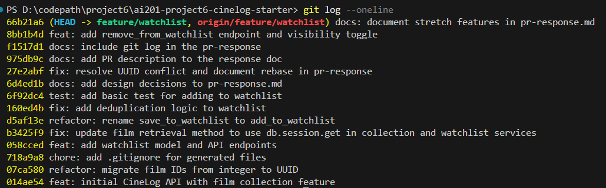

# PR Response Doc — CineLog Watchlist Feature

## AI Usage
<!-- Fill in at the end — how you used AI tools during this project -->
I asked AI to help me understand the models.py and collection service file as suggested in the course instructions.

I asked it to review my response doc to the comments before moving on with the 6th commment.
Based off AI suggestions, I proposed a UI mockup with visible "Public" badge that warns the users that their watchlisted movie is public but they can change it manually.

## Comment 1 — Rename
**What I did:**
I found all the instances of save_to_watchlist with the find all instances tool of vs code and replaced them with the new name add_to_watchlist.
**How I verified:**
I checked that all the instances were renamed and that the code still compiles.

## Comment 2 — Deduplication
**What I did:**
I read the logic used in the collections file and replicated the same logic exactly for watchlist, save using the new watchlist table instead of the collection table
**How I verified:**
I ran the tests to ensure that the code still compiles and that the watchlist feature is working as expected.

## Comment 3 — Missing test
**What I did:**
i used the test_collection.py as an inspiration to learn the AAA method of testing and implemented the same for the singular test asked for add_to_watchlist, I pasted over most of the fixture and changed few words to use the watchlist_service instead of the collection_service.
**How I verified:**
I ran the full test suite to ensure that the code still compiles and that the watchlist feature is working as expected.

## Comment 4 — Default visibility
**My position:** I am intentional about the default visibility of films on the watchlist being public.
**Reasoning:** Since our app is inherently social, making films a user wants to watch public encourages interactions whenever someone visits their profile, for example. It might be more deliberate for users to manually turn a film's watchlist visibility to private than for them to go out of their way to make it public. This is because a user usually has a reason to watch a movie, and if they are sharing it with the world, it's a way to show their personality and interests.
**Tradeoff acknowledged:** 
It might be a little bit oversharing but I think it's worth it for the social aspect of our app. I acknowledge that defaulting to public risks exposing sensitive choices for users who assume the list is private. To mitigate this, we need to ensure the UI makes it explicitly clear (e.g., a visible 'Public' badge) when adding a film that this action is visible to others.


## Comment 5 — Sort order
**My position:** I agree with the reviewer that the films should be sorted by date added, not by title.
**Reasoning:** It makes more sense from a user experience perspective to see the most recently added films at the top of the list, as these are the films that the user is most likely to be interested in. Apart from that it is a nice way to see what films that users feel more interested in watching chronologically, which might compliment their life events or time periods.
**Engagement with reviewer's point:**
I agree with the reviewer wanting to make it default to recent sort. We can add different sort option to sort by title if the user is interested in searching for a specific film or is the list grows much larger.

## Comment 6 — Rebase
**What conflicted:**
There was an explicit merge conflict in `.gitignore`. There was also a silent conflict where `WatchlistEntry` disappeared from `models.py` because the `main` branch deleted it when refactoring `film.id` from an integer to a UUID.
**How I resolved it:**
I resolved the `.gitignore` conflict manually. To fix `models.py`, I recreated the `WatchlistEntry` class but updated `film_id` to use `db.String(36)` instead of `db.Integer` to match the new UUID refactor. I also updated the type hint in the `watchlist_service.py` docstring.
**How I verified no conflict remains:**
I ran `pytest tests/` to verify that the application properly handles adding to the watchlist with the new string-based UUIDs, and all 5 tests passed successfully.

## Stretch Features
**remove_from_watchlist():** Added `remove_from_watchlist(user_id, film_id)` to `watchlist_service.py` along with a custom `NotInWatchlistError`. Created a corresponding `DELETE` route at `/watchlist/<user_id>/remove`.
**Visibility Toggle Endpoint:** Modified `add_to_watchlist` to accept a `public` parameter (defaulting to True) and updated the `POST /watchlist/<user_id>/add` route to parse the `public` flag from the JSON request body.
**Second Test:** Added `test_remove_from_watchlist_not_found_raises` to `test_watchlist.py` to verify that attempting to remove a film the user hasn't added properly raises `NotInWatchlistError`. I chose this edge case because it perfectly complements the `remove_from_watchlist` stretch feature and follows the error-handling pattern of the other test.

## Git Log Screenshot



## PR Description

**Feature Overview:**
This PR introduces the new Watchlist feature to CineLog. Users can now save films they want to watch later by adding them to their personal watchlist. The feature includes a new `WatchlistEntry` database model, an endpoint to retrieve the watchlist, a `POST` endpoint to add films (with an optional `public` visibility toggle), and a `DELETE` endpoint to remove films.

**Design Decisions:**
- **Default Visibility:** Watchlists are public by default to align with the social, sharing-oriented nature of the app. A visible UI badge is recommended to ensure users are aware of this.
- **Sort Order:** Watchlists are sorted by 'date added' (newest first) to prioritize the films a user is most currently interested in, rather than alphabetical order.
- **Deduplication:** Added logic to prevent users from adding the same film to their watchlist multiple times.

**Testing Steps:**
1. Ensure your virtual environment is active and dependencies are installed.
2. Run the specific automated test suite for the watchlist feature:
   ```bash
   pytest tests/test_watchlist.py -v
   ```
3. Verify that all edge-case tests pass, including duplicate handling and attempting to remove a nonexistent film.
4. To verify the entire application remains stable, run the full test suite:
   ```bash
   pytest tests/ -v
   ```
5. All 6 tests should return a `PASSED` status.
